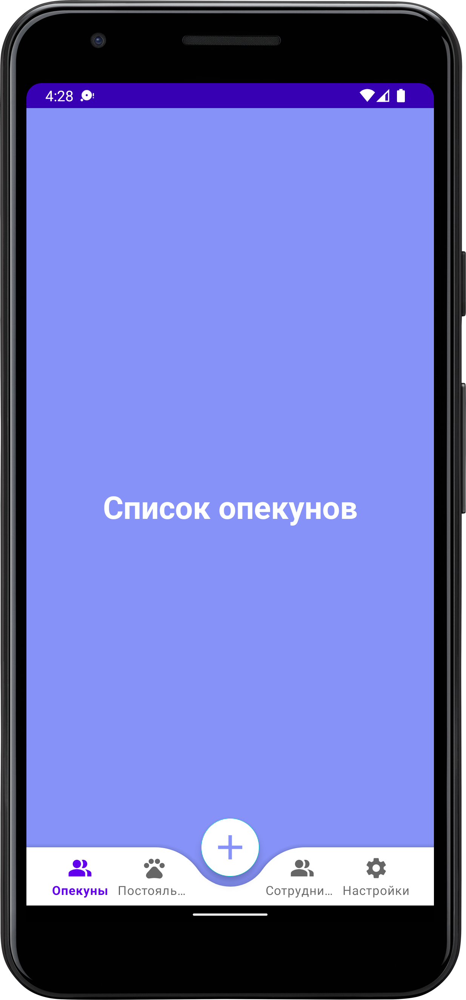
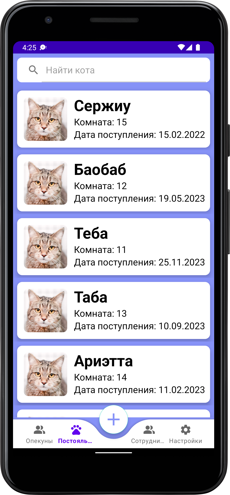
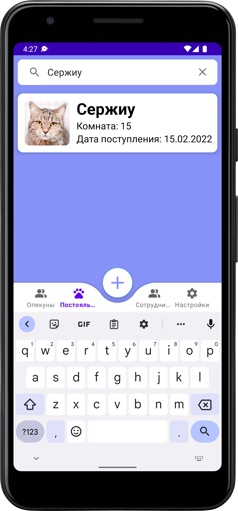
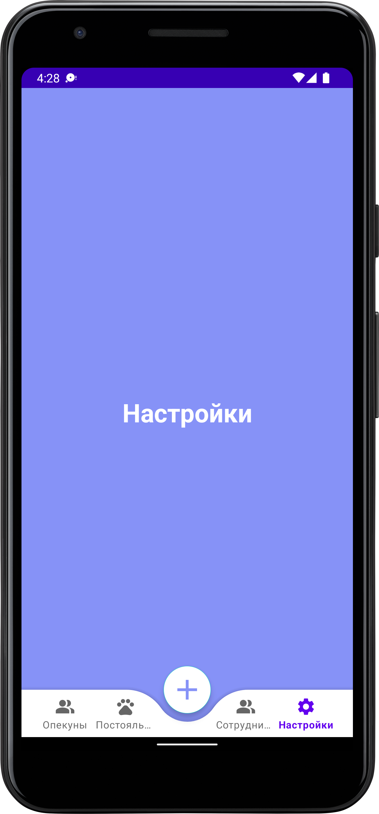
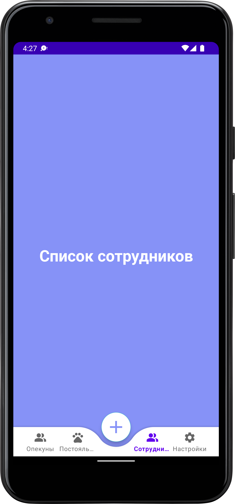

<h1 align="center"> :smiley_cat: Cat Shelter CRM (mobile) </h1>

 Проект в рамках курса "Парадигмы и Конструкции Языков Программирования" (МГТУ им. Н. Э. Баумана, ИУ5, 3 семестр) 

:heavy_exclamation_mark: **Репозиторий с кодом бэкенда: https://github.com/Yu-Leo/bmstu-cat-shelter-crm-back**

## Навигация

* [Описание проекта](#chapter-0)
* [Запуск](#chapter-1)
* [Скриншоты](#chapter-2)
* [Исходный код](#chapter-3)
* [Авторы](#chapter-4)

## :page_facing_up: Описание проекта

CRM-система для управления внутренней деятельностью кошачьего приюта.

## :zap: Запуск

## :camera: Скриншоты

Guardians

Residents

Search residents

Settings

Workers

## :computer: Исходный код

### Технологии

- Язык программирования: **Java**

## :smile: Авторы
- [Ювенский Лев](https://github.com/Yu-Leo)
- [Беспалова Виктория](https://github.com/victobes)
